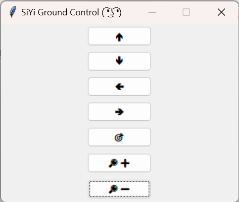

# siyi_sdk
Python implementation of the SDK of SIYI camera-gimbal systems.


* [Camera-gimbal products](https://shop.siyi.biz/collections/gimbal-camera-optical-pod)
* Documentation: [A8 mini](https://siyi.biz/siyi_file/A8%20mini/A8%20mini%20User%20Manual%20v1.6.pdf)

**If you find this code useful, kindly give a STAR to this repository. Thanks!**

# Setup
* Clone this package
    ```bash
    git clone https://github.com/mzahana/siyi_sdk.git
    ```
* Connect the camera to PC or onboard computer using the ethernet cable that comes with it. The current implementation uses UDP communication.
* Power on the camera
* Do the PC wired network configuration. Make sure to assign a manual IP address to your computer
  * For example, IP `192.168.144.12`
  * Gateway `192.168.144.25`
  * Netmask `255.255.255.0`
* Done. 

# Usage
* Check the scripts in the `siyi_sdk/tests` directory to learn how to use the SDK

* To import this module in your code, copy the `siyi_sdk.py` `siyi_message.py` `utility.py` `crc16_python.py` scripts in your code directory, and import as follows, and then follow the test examples
    ```python
    from siyi_sdk import SIYISDK
    ```
* Example: To run the `test_gimbal_rotation.py` run,
    ```bash
    cd siyi_sdk/tests
    python3 test_gimbal_rotation.py
  
    ```

* Use gui

    ```bash
    python3 gui/tkgui.py
    ```


    <video src="gui/demo.mp4" controls title="Demo"></video>
    
     </img>

# Video Streaming
## Requirements
* OpenCV `sudo apt-get install python3-opencv -y`
* imutils `pip install imutils`
* Gstreamer `https://gstreamer.freedesktop.org/documentation/installing/index.html?gi-language=c`
    
    Ubuntu:
    ```bash
    sudo apt-get install libgstreamer1.0-dev libgstreamer-plugins-base1.0-dev libgstreamer-plugins-bad1.0-dev gstreamer1.0-plugins-base gstreamer1.0-plugins-good gstreamer1.0-plugins-bad gstreamer1.0-plugins-ugly gstreamer1.0-libav gstreamer1.0-tools gstreamer1.0-x gstreamer1.0-alsa gstreamer1.0-gl gstreamer1.0-gtk3 gstreamer1.0-qt5 gstreamer1.0-pulseaudio -y
    ```
- Deepstream (only for Nvidia Jetson boards)
    (https://docs.nvidia.com/metropolis/deepstream/dev-guide/text/DS_Quickstart.html#jetson-setup)
- For RTMP streaming
    ```bash
    sudo apt install ffmpeg -y
    pip install ffmpeg-python
    ```

## Examples
* An example of how to receive image frames from camera, see `tests/test_rtsp.py`
* An example of how to stream image frames to an RTMP server, see `tests/test_rtmp_stream.py`
* An example of how to receive an image stream from camera using RTSP and send them to an RTMP server, see `tests/test_from_rtsp_to_rtmp.py`
* C++ application that uses GStreamer to recieve RTSP stream in the camera is available in the `src` directory.
    It can be compiled using
    ```bash
     g++ rtsp_gstreamer.cpp -o rtsp_gstreamer `pkg-config --cflags --libs opencv4 gstreamer-1.0 gstreamer-app-1.0`
    ```
    Then, you can run it using `./rtsp_gstreamer RTSP_URL`

# Tools
* To run a nginx-rtmp server from a docker container 
```bash
docker run -d -p 1935:1935 --name nginx-rtmp tiangolo/nginx-rtmp
```
[Reference](https://hub.docker.com/r/tiangolo/nginx-rtmp/)

* To play an rtmp stream, you can use the following command in a terminal (you will need to install mpv `sudo apt install mpv`)
```bash
mpv   --msg-color=yes   --msg-module=yes   --keepaspect=yes   --no-correct-pts   --untimed   --vd-lavc-threads=1   --cache=no   --cache-pause=no   --demuxer-lavf-o-add="fflags=+nobuffer+fastseek+flush_packets"   --demuxer-lavf-probe-info=nostreams   --demuxer-lavf-analyzeduration=0.1   --demuxer-max-bytes=500MiB   --demuxer-readahead-secs=0.1     --interpolation=no   --hr-seek-framedrop=no   --video-sync=display-resample   --temporal-dither=yes   --framedrop=decoder+vo     --deband=no   --dither=no     --hwdec=auto-copy   --hwdec-codecs=all     --video-latency-hacks=yes   --profile=low-latency   --linear-downscaling=no   --correct-downscaling=yes   --sigmoid-upscaling=yes   --scale=ewa_hanning   --scale-radius=3.2383154841662362   --cscale=ewa_lanczossoft   --dscale=mitchell     --fs   --osc=no   --osd-duration=450   --border=no   --no-pause   --no-resume-playback   --keep-open=no   --network-timeout=0 --stream-lavf-o=reconnect_streamed=1   rtmp://127.0.0.1/live/webcam
```
**OR you can use VLC, but you may notice high latency!**
